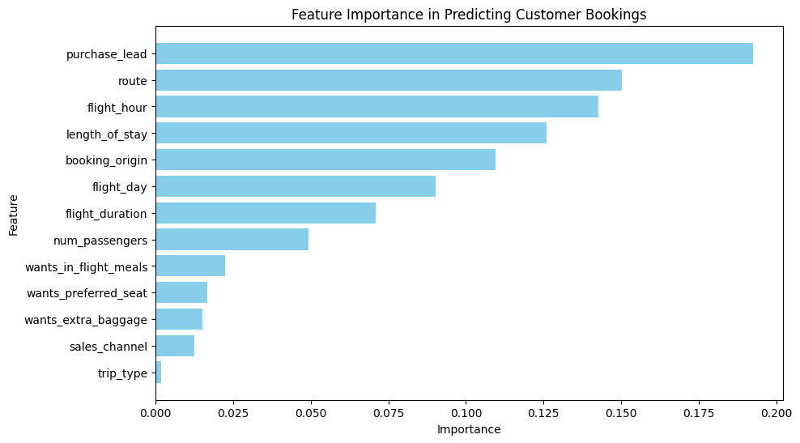

# ✈️ Customer Booking Prediction Analysis

## 📌 Project Overview
This project analyzes various factors influencing **customer flight bookings** using **machine learning models**. The goal is to determine which features have the most significant impact on predicting **customer booking behavior**, allowing airlines to optimize services, pricing, and marketing strategies.

## 🎯 Business Value
- **Enhanced Demand Forecasting**: Helps airlines predict booking patterns and allocate resources efficiently.
- **Optimized Pricing Strategy**: Identifies key factors affecting bookings to adjust ticket pricing dynamically.
- **Improved Customer Experience**: Personalized recommendations based on booking behavior.
- **Revenue Growth**: Maximizing booking rates by targeting high-impact features.

## 🔍 Key Challenges Solved
- **Understanding Booking Patterns**: Identifying critical factors influencing customer bookings.
- **Feature Importance Analysis**: Determining which variables contribute the most to booking predictions.
- **Operational Optimization**: Helping airlines streamline booking workflows and marketing campaigns.

## 📊 Feature Importance Analysis
The following **feature importance chart** highlights the most influential factors in predicting customer bookings:

### **Top Influential Features:**
1. **Purchase Lead Time** - How early customers book before departure.
2. **Route & Flight Hour** - The specific flight path and time of travel.
3. **Length of Stay** - The number of days between departure and return.
4. **Booking Origin** - The location from which the booking was made.
5. **Flight Duration & Day** - The impact of trip length and weekday/weekend flights.
6. **Additional Services** - Preferences for in-flight meals, extra baggage, and seat selection.

## 🚀 How It Works
### **1️⃣ Data Preprocessing & Cleaning**
- Handled missing values and outliers.
- Categorical encoding for non-numeric variables.

### **2️⃣ Model Training & Evaluation**
- Used **Random Forest & Gradient Boosting** for feature importance analysis.
- Evaluated models using accuracy, precision, and recall.

### **3️⃣ Business Insights & Recommendations**
- Focus on early booking incentives to maximize revenue.
- Adjust dynamic pricing strategies based on route, flight hour, and trip type.
- Improve customer retention through tailored offers and marketing.

## 🛠️ Technologies Used
- **Python** (Data Processing & Analysis)
- **Pandas & NumPy** (Data Handling)
- **Scikit-learn** (Machine Learning & Feature Importance)
- **Matplotlib & Seaborn** (Visualization)

